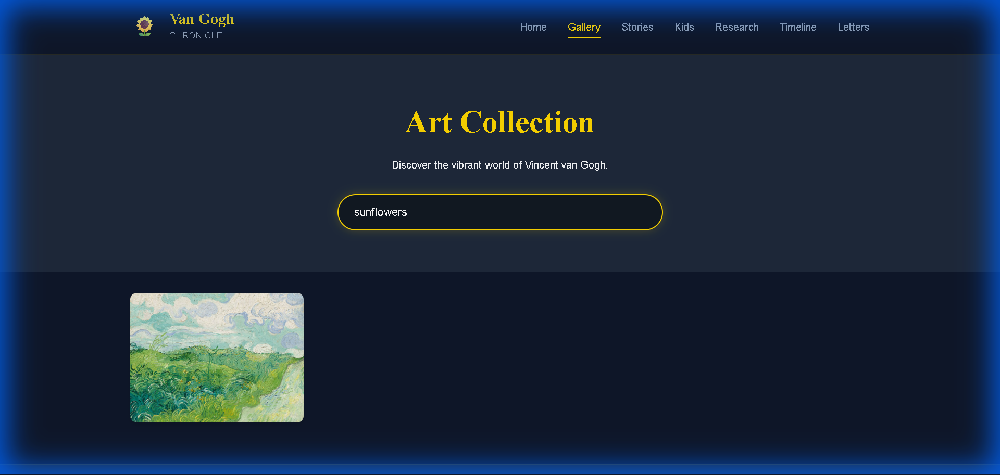
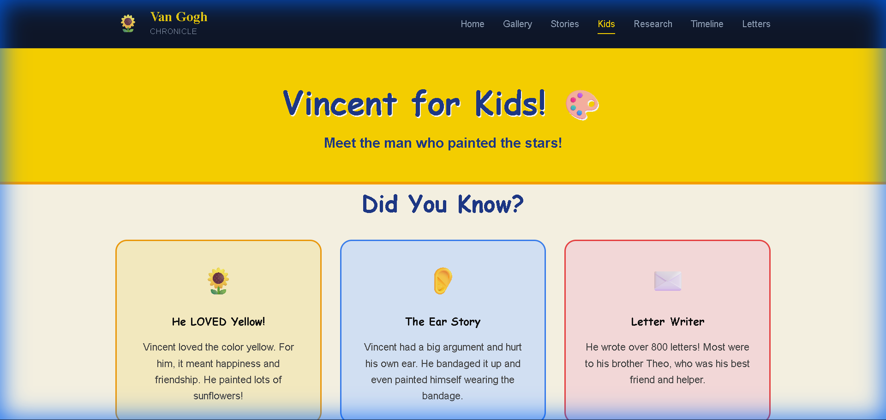
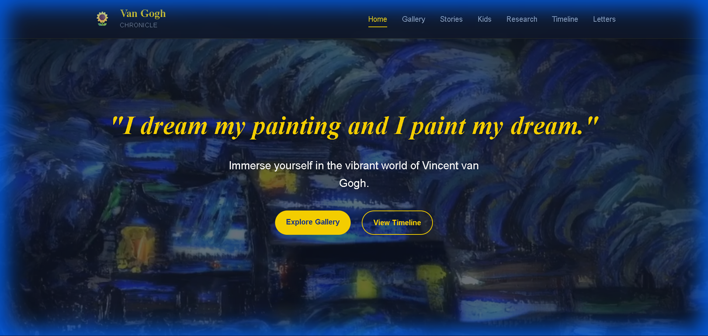

# Starry Night - Van Gogh Chronicle

A modern, interactive web application exploring the life and art of Vincent van Gogh. Built with React, Node.js, and a vibrant "Banana" theme.

## 🎨 Design ("Banana Theme")

I implemented a vibrant design system inspired by Van Gogh's palette:
- **Primary**: Banana Yellow (`#FFD700`)
- **Secondary**: Starry Night Blue (`#1E3A8A`)
- **Background**: Deep Night (`#0F172A`)

## ✨ Features

### 1. Home Page
An immersive landing page with a video background and animated introduction.


### 2. Art Gallery
A dynamic masonry grid displaying over 2,100 artworks fetched from the backend. Includes category filtering and search.




### 3. Timeline
A vertical, interactive timeline showing key life events with integrated images.


### 4. Letters
A reader interface for Van Gogh's personal letters, with expandable content and visual grid layout.


### 5. History & Legacy
Dedicated pages for his detailed biography and lasting impact on modern art.


### 6. For Kids
A dedicated section with fun facts and interactive elements for younger audiences.



### 7. Stories
Curated stories about specific artworks.



## 🚀 How to Run

1.  **Install Dependencies**

    ```bash
    # Install Server Dependencies
    cd server
    npm install

    # Install Client Dependencies
    cd ../client
    npm install
    ```

2.  **Start the Application**

    You need to run both the backend and frontend servers.

    **Terminal 1 (Backend):**
    ```bash
    cd server
    npm start
    ```
    Server runs on `http://localhost:3000`

    **Terminal 2 (Frontend):**
    ```bash
    cd client
    npm run dev
    ```
    Client runs on `http://localhost:5173`

3.  **Open in Browser**

    Visit `http://localhost:5173` to view the application.

## 🏗️ Architecture

- **Frontend**: React (Vite) with Framer Motion for animations and React Router for navigation.
- **Backend**: Node.js/Express server acting as an API and static file server.
- **Assets**: Organized all loose images and videos into `server/public/assets`.

## 📜 License

© 2025 Van Gogh Chronicle. Developed by Aryan Rathore. All rights reserved.
