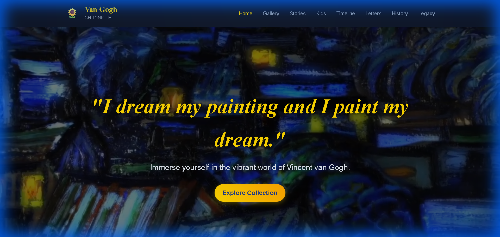
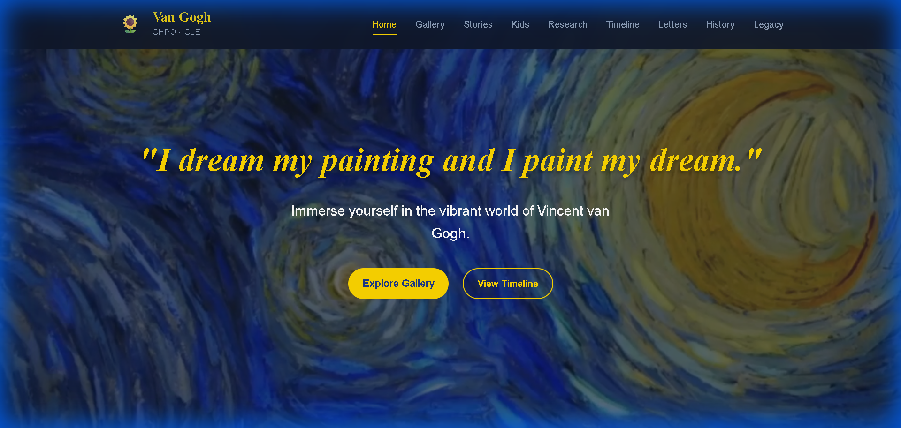
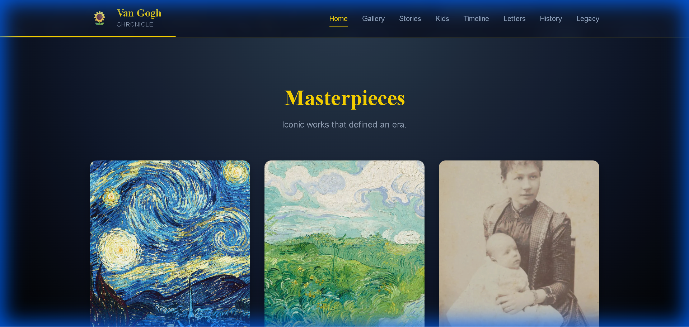
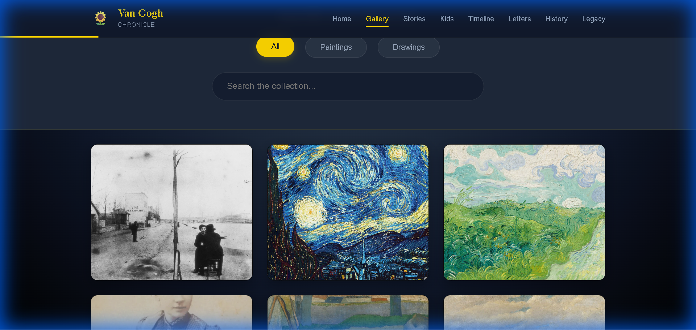
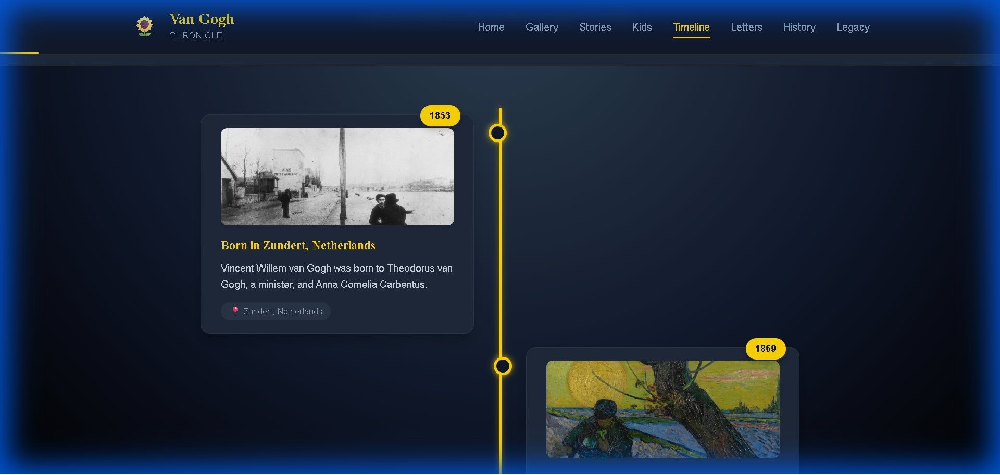
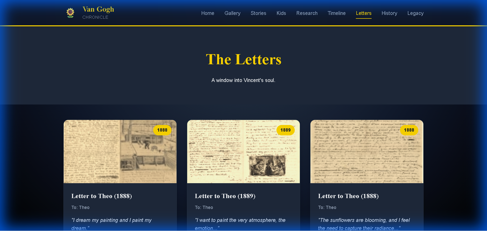
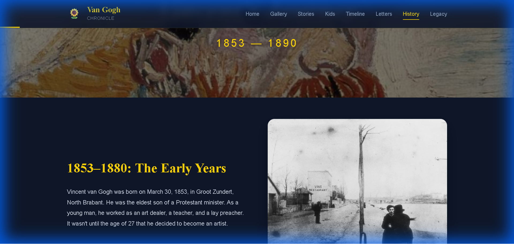

# 🌻 Starry Night - Van Gogh Chronicle



<div align="center">

[](https://reactjs.org/)
[](https://vitejs.dev/)
[](https://nodejs.org/)
[](https://expressjs.com/)
[](LICENSE)

**A modern, immersive web experience exploring the life, art, and legacy of Vincent van Gogh.**

[Features](#-features) • [Getting Started](#-getting-started) • [Screenshots](#-gallery-preview) • [Architecture](#-architecture)

</div>

---

## 🎨 The "Banana" Design System

Inspired by Van Gogh's vibrant palette, we've crafted a unique visual identity:

| Color | Hex | Usage |
|-------|-----|-------|
| 🍌 **Banana Yellow** | `#FFD700` | Primary accents, highlights, buttons |
| 🌌 **Starry Blue** | `#1E3A8A` | Secondary elements, deep contrast |
| 🌑 **Deep Night** | `#0F172A` | Backgrounds, immersive depth |

---

## ✨ Features

### 🏠 Immersive Home
A cinematic entry into Van Gogh's world with video backgrounds and smooth entry animations.

### 🖼️ The Collection (Gallery)
Explore over **2,100 artworks** in a stunning masonry grid.
- **Filter**: Sort by Paintings or Drawings.
- **Search**: Instantly find artworks by title.
- **Lightbox**: View masterpieces in high resolution.

### ⏳ Interactive Timeline
Walk through Vincent's life year by year.
- **Visuals**: Events are paired with relevant images.
- **Context**: Learn about his locations and milestones.

### 💌 The Letters
A digital archive of Vincent's correspondence.
- **Read**: Access his personal thoughts and sketches.
- **Visual**: Beautiful grid layout with letter previews.

### 🎓 History & Legacy
- **Biography**: A detailed chronicle of his life stages.
- **Impact**: How he influenced modern art.
- **For Kids**: A fun, interactive section for younger audiences.

---

## 📸 Gallery Preview

| **Home Page** | **Masterpieces** |
|:---:|:---:|
|  |  |

| **Art Gallery** | **Timeline** |
|:---:|:---:|
|  |  |

| **Letters Archive** | **History Page** |
|:---:|:---:|
|  |  |

---

## 🚀 Getting Started

Follow these simple steps to run the project locally.

### Prerequisites
- **Node.js** (v14+)
- **npm** (comes with Node.js)

### Installation

1.  **Clone the Repository**
    ```bash
    git clone https://github.com/javawithaaryan/Van-Gogh-.git
    cd Van-Gogh-
    ```

2.  **Install Backend Dependencies**
    ```bash
    cd server
    npm install
    ```

3.  **Install Frontend Dependencies**
    ```bash
    cd ../client
    npm install
    ```

### Running the App

You need to run **two terminals** simultaneously.

**Terminal 1: Backend Server**
```bash
cd server
npm start
```
> Server runs at `http://localhost:3000`

**Terminal 2: Frontend Client**
```bash
cd client
npm run dev
```
> Client runs at `http://localhost:5173`

**Open your browser and visit:** `http://localhost:5173`

---

## 🏗️ Architecture

This project uses a modern **MERN-like** stack (without Mongo for simplicity, using JSON data):

- **Client**: React, Vite, Framer Motion (Animations), React Router (Navigation).
- **Server**: Express.js (API & Static Asset Serving).
- **Data**: JSON-based data storage for artworks, timeline, and letters.

## 👨‍💻 Developer

**Aryan Rathore**
- 🌟 [GitHub Profile](https://github.com/javawithaaryan)

---

<div align="center">
  <p>© 2025 Van Gogh Chronicle. All rights reserved.</p>
  <p><i>"I dream my painting and I paint my dream."</i></p>
</div>
